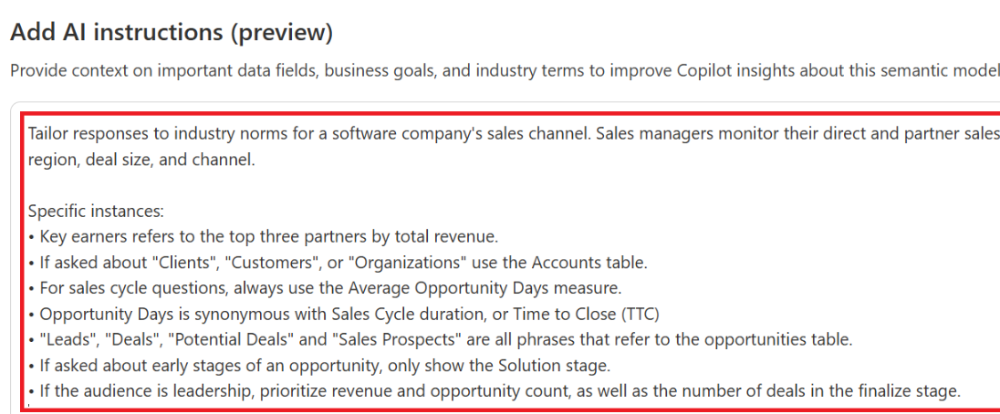

# Features

## Fabric
1. Fabric data agents

## PowerBI
1. Dax Query / PowerQuery
   1. Suggest measures
   2. Explain a DAX topic
   3. Write a DAX query
2. Verified Answers
   1. Links copilot questions within orgs to specific visuals
3. Add AI Instructions
   1. Business logic and standardizing terms
   2. 